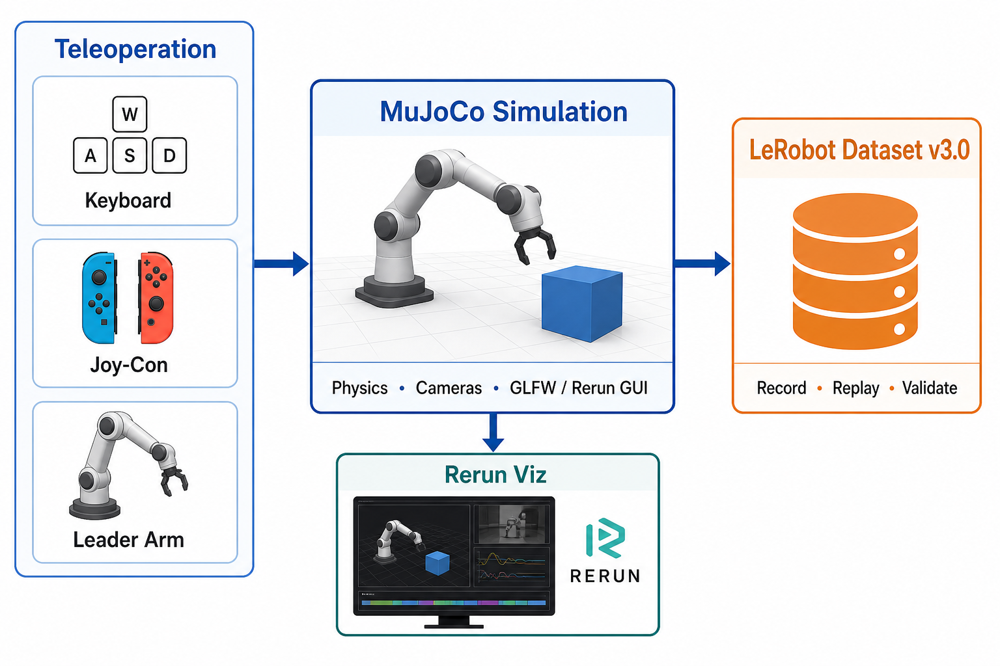

# Design Document

## Goals

Build a clean, maintainable SO-101 teleoperation and dataset-collection project that:

1. Uses latest HuggingFace LeRobot as a submodule **without modifying it**.
2. Runs SO-101 in MuJoCo simulation with keyboard and leader-arm teleop.
3. Targets **AMD ROCm on Ubuntu 24.04** as the **only supported** platform (`make rocm-sync`).
4. Uses Python 3.12+.
5. Supports behavior cloning training and policy inference (planned).

**Platform scope:** Only **Ubuntu 24.04 + AMD ROCm** is supported in the current release. macOS and NVIDIA CUDA are **not supported** (unverified; listed on [ROADMAP](ROADMAP.md) for future work). Do not use `uv sync` — use `make rocm-sync` only.

## Implemented

- Keyboard teleoperation (velocity paradigm; pynput + evdev for Rerun)
- Joy-Con teleoperation (cylindrical velocity: reach/swing; gripper toggle; one-handed recording buttons)
- Leader arm teleoperation (position paradigm, Feetech STS3215)
- Dataset recording and replay (LeRobot v3.0)
- Record display modes: `--view_mode mujoco` (MuJoCo GLFW GUI) or `rerun` (Rerun multi-camera GUI)
- Dataset validation and visualization (Rerun via `dataset_viz`)

## Planned

- Real follower arm hardware driver
- Rerun support in `teleoperate.py` (non-recording preview)
- Behavior cloning training
- Policy inference + MuJoCo rollout

## High-Level Architecture



*Teleoperation inputs → MuJoCo simulation → LeRobot dataset. See [README](README.md#overview).*

```
┌─────────────────────────────────────────────────────────┐
│  LeRobot scripts (lerobot_record, lerobot_replay, ...)  │
│  No modifications allowed                                │
└─────────────────────────────────────────────────────────┘
                            │
                            ▼
┌─────────────────────────────────────────────────────────┐
│  Third-party plugin discovery                           │
│  lerobot_robot_* / lerobot_teleoperator_*               │
└─────────────────────────────────────────────────────────┘
                            │
        ┌───────────────────┴───────────────────┐
        ▼                                           ▼
┌───────────────┐                       ┌─────────────────┐
│  Robot Layer  │                       │  Teleop Layer   │
│               │                       │                 │
│ so101_mujoco  │                       │ so101_keyboard  │
│ so101_real_   │                       │ so101_joycon    │
│ follower      │                       │ so101_leader    │
│ (planned)     │                       │ so101_gamepad   │
│               │                       │ (planned)       │
└───────┬───────┘                       └────────┬────────┘
        │                                        │
        │         ┌──────────────────┐           │
        └────────►│  Action Mapping  │◄──────────┘
                  │                  │
                  │ Convert teleop   │
                  │ output to robot- │
                  │ native action    │
                  └────────┬─────────┘
                           │
                           ▼
                  ┌─────────────────┐
                  │ robot.send_action│
                  │                 │
                  └─────────────────┘
```

## Action Semantics

Two control paradigms are supported:

### Velocity (keyboard, Joy-Con)

```python
{
    "vx": float,              # m/s, end-effector X velocity
    "vy": float,              # m/s, end-effector Y velocity
    "vz": float,              # m/s, end-effector Z velocity
    "wrist_flex_rate": float, # rad/s, wrist flex joint velocity
    "yaw_rate": float,        # rad/s, wrist roll joint velocity
    "gripper_delta": float,   # rad/s, gripper opening rate
}
```

MuJoCo robot uses Jacobian-based IK to convert velocities to joint positions.

### Position (leader arm)

```python
{
    "shoulder_pan.pos": float,   # rad, target joint position
    "shoulder_lift.pos": float,
    "elbow_flex.pos": float,
    "wrist_flex.pos": float,
    "wrist_roll.pos": float,
    "gripper.pos": float,
}
```

Leader arm outputs are auto-scaled from normalized motor values to MuJoCo radians.

## Package Layout

```
so101-simstudio/
├── lerobot/                          # HF LeRobot submodule (pinned, unmodified)
├── src/
│   └── simstudio/
│       ├── robots/
│       │   ├── so101_mujoco/         # MuJoCo simulation (working)
│       │   └── so101_real_follower/  # Real follower arm (stub)
│       ├── teleoperators/
│       │   ├── so101_keyboard/       # Keyboard teleop (working)
│       │   ├── so101_joycon/         # Joy-Con teleop (working)
│       │   └── so101_leader/         # Leader arm teleop (working)
│       ├── common/                   # Shared constants and action mapping
│       └── scripts/
│           ├── record.py             # LeRobot record wrapper
│           ├── replay.py             # Episode replay
│           ├── replay_multi.py       # Multi-episode replay
│           ├── teleoperate.py        # Live teleoperation
│           └── dataset_viz.py        # Dataset visualization
├── SO101/                            # MuJoCo assets
├── configs/                          # Recording/teleop configs
├── llm-wiki/                         # Reusable development knowledge
├── third_party/joycon-robotics/      # Upstream submodule; patched at install via make joycon-sync
├── patches/joycon-robotics.patch     # Local patch (serial compat, English messages)
├── scripts/
│   ├── setup-rocm.sh                 # ROCm environment setup
│   ├── setup-joycon.sh               # Joy-Con editable install + patch apply
│   ├── smoke/                        # Parameterized manual smoke tests
│   └── quicktest/                    # Fixed collaboration record launchers
├── ROADMAP.md                        # Development roadmap
├── DESIGN.md
├── README.md
└── AGENTS.md
```

## LeRobot Plugin Mechanism

Latest LeRobot discovers third-party packages by prefix:

- `lerobot_robot_*` → registered as robot implementations.
- `lerobot_teleoperator_*` → registered as teleoperator implementations.

We expose our packages under these names via `pyproject.toml` optional or namespace packages, or by shipping subpackages named `lerobot_robot_so101_mujoco`, etc.

For simplicity, this project may use a single package with namespace subpackages:

```
lerobot_robot_so101_mujoco/
lerobot_robot_so101_real_follower/
lerobot_teleoperator_so101_keyboard/
lerobot_teleoperator_so101_joycon/
lerobot_teleoperator_so101_leader/
```

All pointing back to `src/simstudio` modules.

## Migration from robopicker

Code to port/adapt:

1. `robopicker/lerobot/src/lerobot/robots/so101_mujoco/robot_so101_mujoco.py`
   - Adapt to latest LeRobot `Robot` base class.
   - Return `RobotAction`/`RobotObservation` type aliases.
   - Ensure `disconnect()` is safe under `__del__`.
   - Fix GLFW window hints (default hints, no FOCUSED=FALSE).

2. `robopicker/lerobot/src/lerobot/robots/so101_mujoco/configuration_so101_mujoco.py`
   - Keep `@register_subclass("so101_mujoco")` pattern.
   - Verify draccus/dataclass compatibility with latest LeRobot.

3. `robopicker/lerobot/src/lerobot/teleoperators/keyboard/teleop_so101_keyboard.py`
   - Replace `lerobot.utils.keyboard_event_manager` with `lerobot.utils.keyboard_input`.
   - Output normalized velocity dict.

4. `robopicker/src/robopicker/scripts/train.py`
   - Port later for training with train/eval splits.

5. `robopicker/SO101/`
   - Copy MuJoCo assets and scene XML.

6. `robopicker/configs/so101_mujoco_record.yaml`
   - Adapt to latest `DatasetRecordConfig` location and fields.

## Testing Strategy

1. **Unit / smoke tests**: verify plugin registration, config loading, action mapping.
2. **Integration test**: open MuJoCo scene preview.
3. **End-to-end test**: record one short episode with keyboard teleop and load it back.
4. **Window visibility test**: on Ubuntu 24.04, verify recording window appears.

## Risks

1. **LeRobot API churn**: latest LeRobot may still change; pin submodule to a known good commit after validation.
2. **ROCm + Python 3.12**: torch ROCm wheels availability must be verified.
3. **Joy-Con Linux support**: depends on `hid-nintendo` / `joycond` drivers; may require manual setup.
4. **Submodule size**: HF LeRobot is large; shallow clones recommended for CI.

## Next Steps

See [ROADMAP.md](ROADMAP.md) for release history and planned work (training pipeline, real follower driver, policy rollout).
