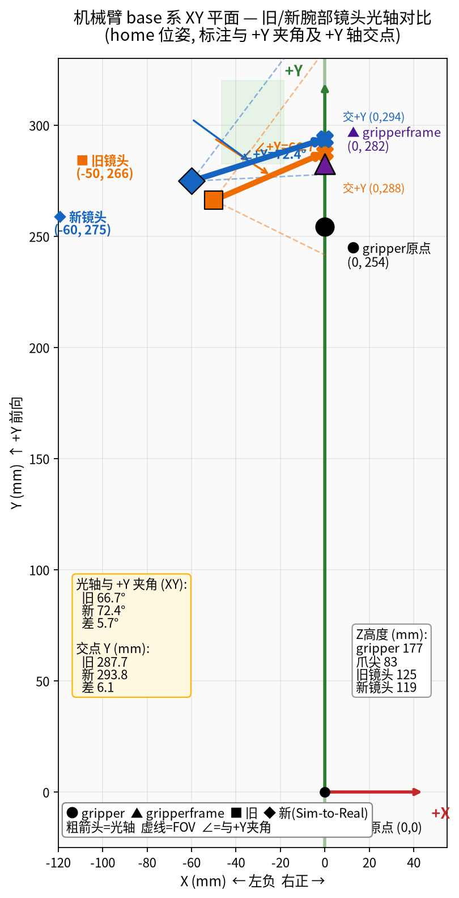

# Wrist camera alignment with Sim-to-Real (Isaac Lab)

MuJoCo wrist camera parameters on branch **`adjust_wrist_cam`** are aligned with the Isaac Sim
**`camera_ego` / `gripper_cam`** sensor in the
[Sim-to-Real-SO-101-Workshop](https://github.com/rocPAI-Forge/Sim-to-Real-SO-101-Workshop)
project.

## Purpose

- Match simstudio MuJoCo **`wrist`** camera to Isaac **`gripper_cam`** offset on the fixed
  **`gripper`** body (not `moving_jaw`).
- Enable sim-to-sim / sim-to-real workflows that share the same wrist view geometry.
- **Old datasets and policies trained on `main` are not compatible** — re-record and retrain
  after switching to this branch.

## Source references

| Project | File | What it defines |
|---------|------|-----------------|
| **Sim-to-Real** | `source/sim_to_real_so101/tasks/task_env_cfg.py` | `camera_ego.offset.pos`, `offset.rot` (Rx −45°), pinhole `focal_length=13.5` mm @ 640×480 |
| **simstudio** | `SO101/so101_new_calib.xml` | `<camera name="wrist">` on **`gripper`** body |
| **simstudio scene** | `SO101/scenes/simple_pick/scene.xml` | Includes robot model; `front` / `top` world cameras unchanged |

Isaac sensor (relative to **`Robot/gripper/gripper_cam`**):

```python
camera_ego.offset.pos = (-0.005, 0.06, -0.062)   # metres
camera_ego.offset.rot = euler_angles_to_quat([-45, 0, 0], degrees=True)  # OpenGL convention
```

## MJCF parameter change

Parent body: **`gripper`** (fixed jaw).

| Parameter | `main` (old) | `adjust_wrist_cam` (new) |
|-----------|--------------|---------------------------|
| `pos` (m) | `-0.0103  0.0497  -0.0531` | **`-0.0050  0.0600  -0.0620`** |
| `quat` (wxyz) | `0.680 -0.236 -0.248 -0.648` | **`0.923880 -0.382683 0 0`** (Rx −45°) |
| `fovy` (deg) | `65` | **`60.4`** (≈ Isaac vertical FOV for f=13.5 mm) |

New MJCF line:

```xml
<camera name="wrist" pos="-0.0050 0.0600 -0.0620" quat="0.923880 -0.382683 0 0" fovy="60.4"/>
```

Gripper-frame verification (MuJoCo FK @ home: `wrist_flex=1.2`, other arm joints 0):

- Position: `(-0.005, 0.060, -0.062)` m ✓
- Look direction: `(0, -0.707, -0.707)` (MuJoCo camera −Z axis) ✓

## Base-frame geometry (home pose)

Coordinate convention for the diagram below:

- **+Y** = robot forward (up on the plot)
- **+X** = right (cameras at **X < 0**, left of centreline)
- **gripper** origin and **gripperframe** lie on **X = 0**
- Values from MuJoCo FK (`simple_pick/scene.xml`), base origin at shoulder base

### Reference points (mm)

| Point | X | Y | Z |
|-------|---|---|---|
| gripper origin | 0 | 254.3 | 177.4 |
| gripperframe (fixed fingertip) | 0 | 282.5 | 83.1 |
| **Old wrist** | −50.0 | 266.2 | 125.1 |
| **New wrist** | −60.0 | 274.8 | 118.9 |

### Optical axis vs +Y (XY plane)

| | Old | New |
|--|-----|-----|
| Angle to **+Y** | **66.7°** | **72.4°** |
| Intersection with **+Y** axis (0, Y) mm | **(0, 287.7)** | **(0, 293.9)** |
| Distance ahead of gripperframe (+Y) | **+5.3 mm** | **+11.4 mm** |
| Old ↔ new intersection ΔY | — | **+6.1 mm** |

Lens XY displacement (old → new): **~13.2 mm**.

## Diagram



Legend: ● gripper origin · ▲ gripperframe · ■ old wrist · ◆ new wrist · thick arrows =
optical axis to +Y intersection · dashed = FOV boundary (65° / 60.4°).

## Branch usage

```bash
git checkout adjust_wrist_cam
# MJCF already updated; record / teleop as usual
python -m simstudio.scripts.teleoperate --config configs/so101_mujoco_leader_teleop.yaml
python -m simstudio.scripts.record --config configs/so101_mujoco_leader.yaml --view_mode rerun
```

Preview wrist RGB only (home pose, no recording):

```bash
.venv/bin/python -m mujoco.viewer --mjcf=SO101/scenes/simple_pick/scene.xml
# In viewer: Camera → wrist
```

## What this does *not* change

- USD mesh / `camera_mount` visual in Sim-to-Real (CAD appearance ≠ Isaac imaging point).
- `front` and `top` scene cameras in `scene.xml`.
- Swapping USD into MuJoCo does **not** align cameras — only MJCF `<camera>` params do.

## Related analysis

Initial comparison and Isaac-side notes may also appear under
`Sim-to-Real-SO-101-Workshop/docs/` (see `wrist_camera_reference.md`).
